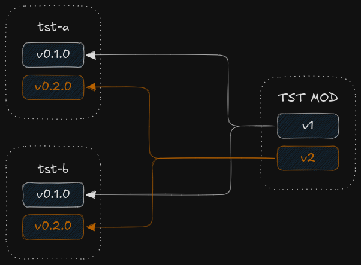

# The `tstmod` package

The `tstmod` package provides a simple way to create a test module with two
external dependencies:

- github.com/ctx42/tst-a
- github.com/ctx42/tst-b

These test modules are designed to validate the correctness of the
package-finding mechanism in the `mocker` package, which is crucial for 
generating mocks. By creating a predictable module structure, `tstmod`
lets me focus on testing how mocker discovers and processes dependencies,
without the hassle of manually setting up test modules.

Test modules come in two versions, differing in dependency versions, as shown
below:

This variation ensures I can thoroughly test `mocker`’s ability to handle
different package versions correctly.
